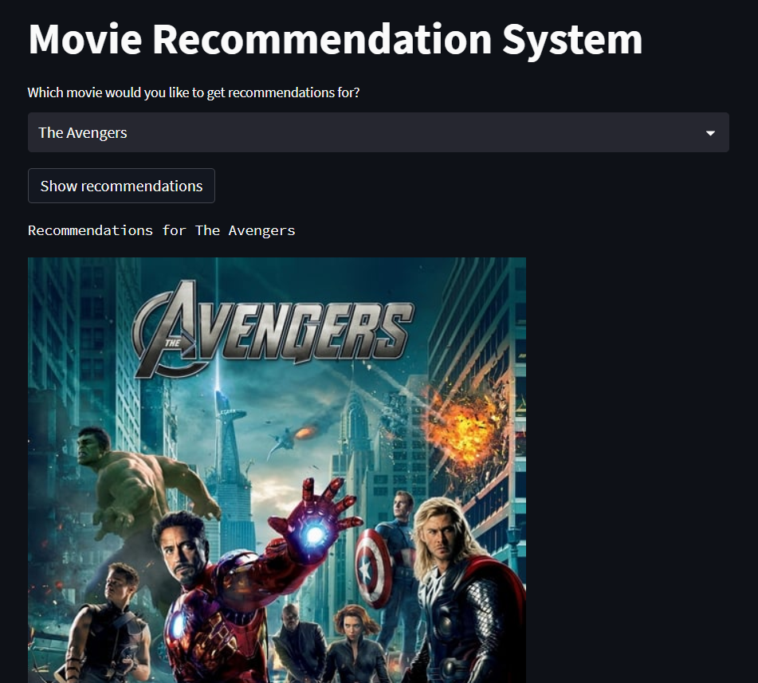
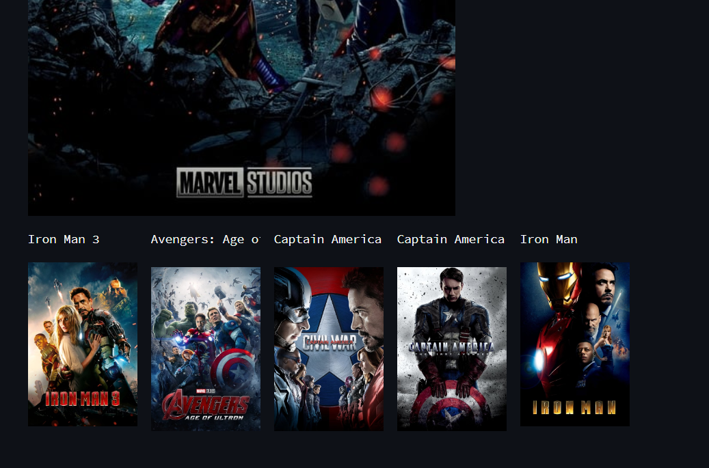

# Movie recommendation system

Movie recommendation system using content based filtering.

### Dataset

Dataset used is TMDb 5000 Movie Dataset. It contains 4803 movies with 20 features.
Link: [click here!](https://www.kaggle.com/datasets/tmdb/tmdb-movie-metadata?select=tmdb_5000_movies.csv)

### Demo

Below is the image of the working web app made using Streamlit.

### How to run

1. Clone the repository
2. Install the requirements
3. Run the app.py file using the command `streamlit run app.py` in webapp directory
4. Open the link shown in the terminal
5. Enter the movie name and click on the button
6. The recommended movies will be shown